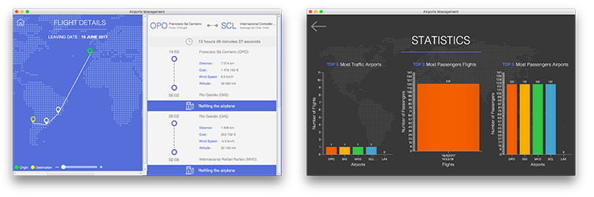

## Project Proposal
# Application of Nonlinear Data Structures and Object Oriented Programming (OOP) using the JAVA programming language: Flights and Company case study
*Within subjects: Algorithms and Data Structures II & Programming Languages II*

March 2017

Fernando Pessoa university

Faculty of Science and Technology

Demonstration

Screenshots

# Collaborators

### Ricardo Pereira Barbosa

### Rui Miguel Martins

# Licence
Made with ❤️ in Portugal
